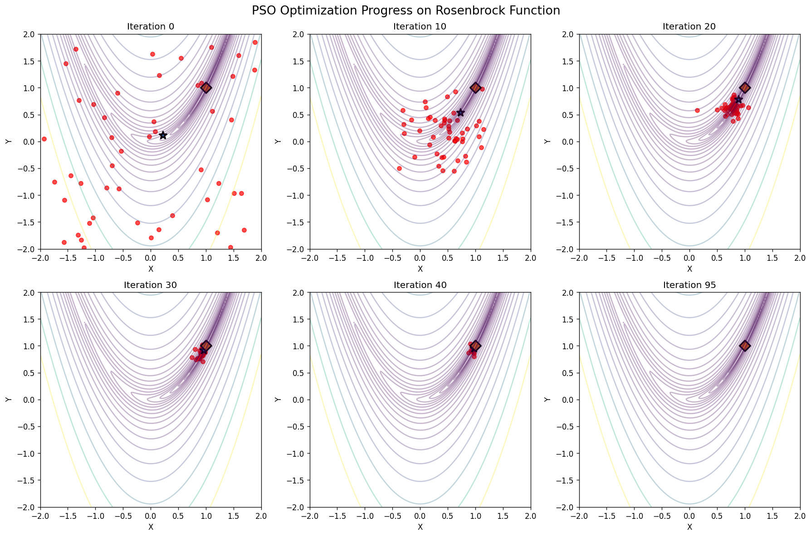

# Particle Swarm Optimization (PSO)

Implementation of **Particle Swarm Optimization (PSO)** consistent with the [`softpy`](https://github.com/andreacampagner/softpy) library, developed as part of the *Fuzzy Systems & Evolutionary Computing* course (A.Y. 2024/2025, UniMiB).  

---

## Highlights

- **Implemented from scratch**: particle dynamics, velocity updates, and swarm evolution.  
- **OOP & Design Patterns**: subclassed `FloatVectorCandidate` and applied the Factory Method.  
- **Metaheuristics**: applied swarm intelligence concepts (personal, local, global bests).  
- **Numerical Computing**: vectorized with NumPy, handled boundaries, and ensured reproducibility.  
- **Algorithm Engineering**: managed in-place state updates using deep copies to preserve best positions.  
- **Testing**: verified correctness on benchmark functions (Sphere, Rosenbrock).  

---

## Optimization Example

Visualization of PSO optimization on the **Rosenbrock function**:



Particles (red) converge toward the global optimum (star) as iterations progress.  

---


## Quick Start

### Option A — Minimal demo
```bash
pip install -r requirements.txt
python run_demo.py
```

## Option B — Full test harness + visualizations

Use the harness to run tests and generate optimization plots:

```bash
python test.py my_impl.py --pop 50 --nei 10 --iters 100
```

	•	--pop: population size (number of particles)
	•	--nei: number of neighbors considered for each particle
	•	--iters: number of iterations (steps)

Example: sweep over multiple configurations in one run:
```bash
python test.py my_impl.py --pop 30,50 --nei 5,10 --iters 100,200
```

This will run PSO with:

•	2 different population sizes (30, 50)
•	2 different neighborhood sizes (5, 10)
•	2 iteration counts (100, 200)
    
→ creating a total of 8 runs and saving plots in the pictures/ folder.


## Project Structure

```text
├── docs/                   # Assignment specification (PDF)
├── pictures/               # Optimization plots generated by test harness
├── particle_candidate.py   # Particle representation (ParticleCandidate class)
├── optimizer.py            # Particle Swarm Optimizer class
├── my_impl.py              # Wrapper to expose both classes to the test harness
├── run_demo.py             # Minimal demo script for quick execution
├── test.py                 # Test harness with visualizations
├── requirements.txt 
├── README.md
└── .gitignore

```